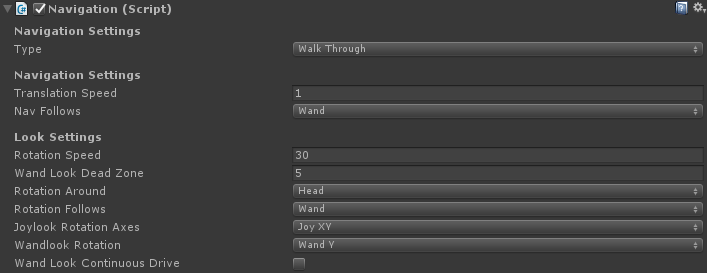

# Developing Unity Games with getReal3D

This section will focus on using the getReal3D plugin to develop Unity games as well as cover
important topics for Unity developers.

## Key Components

From a developers' perspective, the important components of getReal3D
are:

1. The getReal3D *configuration file* defines how and where your games will run, such as the
   display system and all its hardware, the input devices, and various other settings.

2. The getReal3D *daemon* must always be running on workstations where your game will run.

3. The getReal3D *launcher* is a separate application that lets you deploy and run your Unity
   games.

4. The getReal3D *plugin* embedded inside the Unity game is bundled inside the games created
   with Unity and provides run-time VR behaviors.

## System Requirements

Developing Unity games with getReal3D for Unity requires the following:

1. A supported Unity version (see Compatibility Matrix in User Guide)

2. Windows 10 64-bit

3. A D3D9-capable (or better) graphics card with the developer only getReal3D license. A quad-
buffered stereo capable graphics card (such as an Nvidia Quadro card) may be required for
active-stereo modes under the non-developer getReal3D licenses.

## Installation

By default, getReal3D for Unity will be installed into:
`C:\Program Files \Mechdyne\getReal3D for Unity 4` folder. Additionally, the getReal3D Daemon will
 manage (and on a cluster, distribute) Unity games in:
`C:\ProgramData\Mechdyne\getReal3D for Unity 3\CACHE`.

Follow the Unity installer instructions for a developer install. The installer provides the
following components:

- getReal3D for Unity plugin
- getReal3D for Unity Launcher
- getReal3D for Unity daemon
- getReal3D for Unity demo game
- Flexera FLEXlm (license manager). This is skipped during installation if it already exist on
  the system.

## Develop games in the Unity Editor

### Import the getReal3D Plugin

Developing games with getReal3D for Unity requires the getReal3D plugin. The plugin adds a custom
getReal3D menu to the Unity Editor. It is located at `C:\Program Files\Mechdyne\getReal3D for
Unity 3\For Unity games\getReal3D_Plugin_X.X.X.X.unitypackage`.

1. **Select** Assets > Import Package > Custom Package from the main menu
2. **Navigate** to the getReal3d plugin location
3. **Click Import** to import everything

Note: If you have previously played the current games inside the current Unity Editor session,
you must quit the Unity Editor before importing or the import will fail to update the core plugin
(`gr_plugin.dll`).

There are several required Quality and Player settings, so getReal3D presents a
*getReal3D Required Settings* dialog warning if those settings are not set. In this dialog, you can
fix or ignore all or individual required settings.


### Running Games in the Editor

Games using getReal3D for Unity can be run inside the editor for testing and debugging just like
any other Unity game. The games still require a getReal3D configuration. The getReal3D configuration
file is in the game at `getReal3D/Resources/editor_config.gr3d`.

Running in the editor allows you to test VR features like tracking and navigation, and also provides
the ability to test how the getReal3D plugin generates cameras corresponding to your configuration.
When running games in the editor, the screens of the first computer referenced in your
`editor_config.gr3d` become the main game views. All other screens are ignored. The Unity camera
preview will be different than the actual camera view once the game is running with getReal3D.
It is possible to change the configuration used by the editor in the getReal3D / Advanced / Settings
dialog. It is also possible to add new configuration file into the game resources folder.

#### trackdsimulator

Most games built with getReal3D for Unity will use trackd inputs from head/hand trackers and
controllers. As an alternative to using the tracking equipment, the trackdsimulator can be used for
testing purposes. This is a convenient option that alleviates steps during the testing process. The
trackdsimulator GUI allows the user to simulate head/hand sensors, joystick valuators, and control
buttons of the tracking equipment. A separate console window will show the values that are being
tracked/shown while the simulator is running. The simulator can be found on the start menu at
Mechdyne > getReal3D for Unity 3.


#### Room of Shadows demo

getReal3D for Unity includes the Room of Shadows demo game, located at:
`C:\Users\Public\Documents\Unity Projects\getReal3D Shadow Demo`.
The demo illustrates the following standard VR features:
- User-centered perspective. This means the game view will always be from the perspective of a
tracked user inside the VR environment.
- Walkthrough navigation. This is a simple navigation style where joysticks are used to control a
character walking on solid surfaces.
- A pointing device (wand). The virtual wand is drawn with the users' tracked hand position and
orientation. The wand can interact with objects in the scene (as described below).

The example below is using the trackdsimulator.
1. Start the trackdsimulator
2. Select the Apartment Scene (from Unity)
3. Click Play in the editor


The game can be controlled using the simulator GUI. To see the apartment correctly within the game
window, raise your head and hand sensors above their default position on the floor (`Y=O`)


The trackdsimulator controls the game as described below. The default mapping of sensors and
controller inputs to their logical function inside the game, can also be customized in your
getReal3D configuration:

- Use the head and wand sensors, XY and Z, to control and position your head and hand
- Use the wand orientation ball to rotate your wand
- Use the left joystick control to move forward/back & turn left/right
- Use the right joystick to look up/down & strafe left/right
- Use button 2 to jump
- Use button 3 to reset the up/down look angle
- Use button 4 to change the wand type:
    - Green wand: points and casts shadow
    - Blue wand: grab objects by toggling button 1
    - Red wand: solid wand to knock objects around

### Enable VR capabilities

When the getReal3D_Plugin_X.X.X.X.unitypackage is imported into a project, several sample
scripts and prefabs are made available. These resources will provide working examples of what can be
done with the getReal3D for Unity API.

The easiest way to get started with a new game in getReal3D is to enable standard VR features using
the GenericPlayer prefab (within the `getReal3d/Prefabs` folder) as was done with the Unity Shadow
demo example.


Use this approach if any of the following are true:
- You want the 3D scene to use a head-centered perspective – i.e. the scene is rendered according
to the trackers' head position.
- You want to use first-person navigation with a standard VR navigation script. For example,
virtually walking on solid surfaces but not through solid objects.
- You don't have existing cameras or character controllers that you need to retain.

### Convert Your Game
1. Delete or disable any camera objects in the hierarchy root. The old cameras are no longer
needed since getReal3D for Unity manages all of the VR cameras.
2. Add the GenericPlayer prefab to the hierarchy root from the project folder
`getReal3d/Prefabs`. This includes head and hand objects and a getReal3D managed camera

### Game navigation without first-person perspective

In some cases, you might want to modify existing GameObject character navigation or animation to
work with getReal3D without using a VR first-person perspective. You will be able to control and
observe the GameObject in a VR scene, but you won't witness the scene from its perspective.

This is accomplished by replacing calls to `UnityEngine.Input` with `getReal3D.Input` where inputs
are provided to the character controller or animation. For example, a script that provides inputs
to a Mecanim animator was modified as shown below:

```cs
// setup h variable as our horizontal input axis
//float h = Input.GetAxis("Horizontal");
float h = getReal3D.Input.GetAxis("Yaw");

// setup v variables as our vertical input axis
//float v = Input.GetAxis("Vertical");
float v = getReal3D.Input.GetAxis("Forward");

// set our animator's float parameters
anim.SetFloat("Speed", v);
anim.SetFloat("Direction", h);
```

Yaw and Forward are default logical input names corresponding to horizontal and vertical (as defined
in the getReal3D Input Editor. They will also map Unity's horizontal and vertical input values if
you are running without getReal3D.

### Add VR Interaction
You can add standard VR interaction to your game from the GenericPlayer prefab. This prefab has a
game object representing the hand of the user. The attached GenericWandUpdater script updates the
hand position, while the GenericWandManager prefab provides interaction modes where a visible wand
can point at, collide, or grab objects in the scene.

### Add a VR Menu System
getReal3D versions 3.1 and higher support 3D menus that are displayed in the user head space and
controlled by a 3D tracked device. This feature uses Unity New UI system, available in versions 4.6
and higher. Knowledge of this New UI system is required in order to create VR menus.


#### Using prefabs
1. Drag and drop the EventSystem prefab from the prefabs folder
2. Drag and drop the GenericPlayer from the prefabs folder
3. Add/Modify UI pages from the Head/Menu/Panel/Pages game object from the player

#### Manual setup
1.  Set 3D menus to retrieve the tracked devices events
    a. Replace the mouse module in the EventSystem of the scene with the GenericWandEventModule.
    b. Disable the default StandaloneInputModule .

2.  Add a camera to the wand object. In the Unity Editor, verify that the camera follows the wand
    orientation and position.
    a. Set the culling mask to Nothing
    b. Set the depth to -100

3.  Create a new UI/Canvas. If the menu is intended to be a HUD, select the head as a parent.
    a. Set the render mode to World Space
    b. Set the event camera to the previously created wand camera

### Synchronize Unity Components

getReal3D for Unity adds the ability to synchronize games running in multiview mode. In multiview
mode, multiple copies of your game run on the network, as required by your getReal3D configuration.
There will be a single master game and one or more remote games. The master game will always be the
first computer in your getReal3D configuration file.

The synchronization of most Unity components is accomplished automatically. However, some events
only occur on the master:
- 2D UI displayed on the master game window
- Keyboard and mouse inputs on the master game window using Unity API.

These events may be the best choice when the user has access to the master game window or when an
operator is using the master game window and/or keyboard in order to trigger game related actions
(loading a new scene, starting a scenario, changing parameters, etc.,). Since the script logic that
responds to those events is not running on the remote games, an RPC call is used for
 ynchronization.

#### Simple RPC Call
The following example toggles the state of a game object when a key is pressed on the master game
window. The Update callback determines if the game is the master and that the key was pressed. If
true, it generates an RPC call on the master game as well as all remote games. This ensures that the
cluster is synchronized.

```cs
using UnityEngine;
public class ToggleUsingKeyboard : getReal3D.MonoBehaviourWithRpc
{
    public GameObject target;
    public KeyCode keyCode;
    void Update()
    {
        if(target != null && getReal3D.Cluster.isMaster &&
            UnityEngine.Input.GetKeyDown(keyCode)) {
            CallRpc("toggleActive");
        }
    }
    [getReal3D.RPC]
    void toggleActive()
    {
        target.SetActive(!target.activeSelf);
    }
}
```

#### Using RPC Arguments
An arbitrary number of arguments can be added to the method, provided getReal3D knows how to
serialize those arguments. For instance, it is possible to call:
```cs
CallRpc("foo", true, Vector3.up);
```

The corresponding method is defined:

```cs
[getReal3D.RPC]
void foo(bool on, Vector3 v) { }
```

getReal3D currently supports the following data types: enum, bool, byte, char, short, int, uint,
string, float, Vector2, Vector3, Quaternion, Color and Color32. Any other data type must be
serialized into a string.

RPC Limitations
- A class using RPC must inherit `getReal3D.MonoBehaviourWithRpc`.
- An RPC method must use the `[getReal3D.RPC]` attribute.
- If a class using RPC is using OnEnable or OnDisable callbacks, then it must call the base function
on the MonoBehaviourWithRpc.
- RPCs are identified by the method name. Therefore, RPCs can't have the same RPC method
name within a single class.

#### Correct Synchronization Issues
There is a multiview synchronization issue when object(s) appear differently in the left and right
eyes or appear differently on different screens. To test, position objects so that they overlap
multiple screens. A multiview synchronization error will result in a visual discrepancy in the
object at the seam between the screens.

### Wrap Calls to 2D IMGUIs
The "Immediate Mode" GUI system (also known as IMGUI) is deprectated and should be replaced by
Unity's main GameObject-based UI system.

It is recommended that Unity 2D immediate mode GUIs are modified to allow getReal3D for Unity to
control where the IMGUI will be displayed. The getReal3D configuration file includes a setting
called *Show User Interface* which allows users to determine what screens display the GUI. For this
setting to work, the IMGUI code must be surrounded by a Begin/EndGUI guard as in the following
example:

```cs
void OnGUI()
{
    if (!getReal3D.GUI.BeginGUI()) return;
    GUILayout.BeginArea(new Rect(0,0,150,getReal3D.GUI.height));
    GUILayout.FlexibleSpace();
    GUILayout.BeginVertical("Lights", GUI.skin.window );
    foreach( Light l in lights )
    {
        l.enabled = GUILayout.Toggle(l.enabled, l.name );
    }
    GUILayout.EndVertical();
    GUILayout.EndArea();
    getReal3D.GUI.EndGUI();
}
```

When used this way, the BeginGUI() and EndGUI() calls ensure that Unity's rendering invocation only
happens on nodes designated to show the UI. The height and width fields in getReal3D.GUI ensures
that the GUI will be the same size on all screens.

When running in multiview mode, extra steps must be taken to synchronize any state changes made
from the GUI. Refer to the Synchronize Unity Components section and the
`getReal3D/Scripts/GUIs/getRealVRSettingsUI` script provided.

### Add a Stereo-Correct Skybox
The default Unity skybox will not display correctly in multiview or in a stereo window. The project
folder `getReal3d/Examples/Skybox` contains the skeleton of a skybox that will work correctly with
getReal3D for Unity. Please follow these instructions to create a skybox for your game:

1.  **Import** a resource for Skybox textures, if necessary. For example, you can use the standard
    Unity skyboxes: Assets > Import Package > Skyboxes.

2.  **Instantiate** the prefab in getReal3d/getRealSkybox either as a child of your navigation
    GameObject in the hierarchy view or as a root-level GameObject .

3.  Set the getRealSkybox script's Follow Position Transform to that of the navigation GameObject.

4.  Create a new material for each face of the skybox: back, front, left, right, up, down.
    a. Set the shader for each material to getReal3d/Materials/getReal3D Skybox or use the
        supplied material of the same name.
    b. Set the texture for each material to the desired texture, for example, from Standard
        Assets/Skyboxes/Textues/DawnDusk.

Note: The face names in the getReal3D Skybox prefab maintain the Unity skybox texture
naming convention. As an example, with the camera facing along the +Z axis with +Y up, the Left
texture appears to the right.

5.  Attach the material to the skybox faces in the game hierarchy under
    MainCamera/skybox/skybox_mesh.

6.  Optional: The position of the MainCamera/skybox/skybox_mesh may need to be adjusted to
    achieve the desired effect.

### Synchronize Game Level Loading

To change levels in a multiview game, call `SceneManager.LoadScene`. Do not use the
`SceneManager.LoadSceneAsync` as it will behave differently on each node of the cluster.

### Synchronize Audio
In the multiview mode, getReal3D for Unity provides a mechanism for determining which Unity
instances produce sound. By default, it is the first computer host in the configuration, but this
may be changed in the configuration editor.

### Random Number Generation
getReal3D automatically initializes Unity random number generator with a value that is common to all
instances of the cluster. Therefore, a random number may be used in a getReal3D enabled game.

### Verify, build, and optimize games

#### Check the Scene
Scene Checker opens a dockable window that shows the status of the current scene and gives
suggestions on steps to prepare a scene for running on the getReal3D cluster.


The Scene Checker will provide the following notifications:
- If a getRealCameraUpdater script is found.
- If any getReal3D navigation script is found.
- If there are common script changes – to ensure a game can run in the getReal3D cluster.

Note: If the scene is edited or a new scene opened, click the Update button to refresh the Scene
Checker information.

#### Build the Game Executable

Building a game using getReal3D for Unity is very similar to any other Unity game. Once the game is
built, it must be added to the Launcher.

### Developing and running with an OpenXR compatible HMD

- Add the OpenXR package to the project via Unity Package Manager. Restart when asked to switch to
    new Unity inputs.

- In the Unity Project Settings > Player > Other Settings > Configuration, set Active Input Handling
    to *Both*, then restart again.

- In Project Sesttings > XR Plug-in Management, check the OpenXR box

- In Project Sesttings > XR Plug-in Management > OpenXR, add an interaction profile corresponding to
    the HMD.

- Back in the Unity Package Manager, select the OpenXR plugin, expand the Samples item, then import
    the Controller sample.

- Load the ControllerSample scene, then make a prefab out of the PlayerRig gameobject.

- Load the getReal3D scene, then drop the PlayerRig prefab as a child of the GenericPlayer, then
    rename it *[OpenXR Display]*.

- Disable that *[OpenXR Display]* game object.

- Add a *OpenXRPlayerInputs* script on the *[OpenXR Display]* game object.

- Drag and drop the *[OpenXR Display]/Head* game object into the *Head Transform* field of the
    *OpenXRPlayerInputs*.

- Drag and drop the *[OpenXR Display]/RightHand/Grip* into the *Head Transform* field of the
    *OpenXRPlayerInputs*.

- Setup the bindings in the *OpenXRPlayerInputs* to the left and right hand controllers as needed.


- In the *VRToolkitChoice* of the GenericPlayer, click on the *Add toolkit* button.

- Drag and drop the *[OpenXR Display]* object on the Target of the new VR tooklit choice entry.

- Rename the toolkit entry *OpenXR Display*.


- Test in the editor, then remove the unneeded canvases from the Left and Right hands of the
    *[OpenXR]* hierarchy.

## Reference

### Scripts

The scripts in getReal3D for Unity come in four major sections: GUI, Navigation, Updaters, and
Utils.

#### Updaters

When a configuration requires multiple cameras (due to the presence of multiple channels in the
configuration), getRealCameraUpdater will create any necessary additional cameras, either as a clone
of an attached Camera Prefab object, or as a clone of its own GameObject if the Camera Prefab is
empty.

- *getRealCameraUpdater*
    This script positions and orients the camera according to head tracking and applies the camera
    projection necessary for the assigned screen geometry. This script is usually attached to main
    camera in the game.

- *GenericHeadUpdater*
    This script updates the attached GameObject to represent the position and orientation of the
    tracked head. This script uses the GenericPlayerInputs interface. Refer to Generic inputs and
    rendering section.

- *GenericWandUpdater*
    This script updates the attached GameObject to represent the position and orientation of the
    tracked hand/wand. This is useful for providing a reference point for grabbing, pointing, and
    other user interactions. This script uses the GenericPlayerInputs interface. Refer to Generic
    inputs and rendering section.

- *getRealSensorUpdater*
    This script will update the attached GameObject to represent the position and orientation of a
    trackd sensor.

- *getRealWandUpdater*
    This script is deprecated in favor of GenericWandUpdater script.

- *getRealHeadUpdater*
    This script is deprecated in favor of GenericHeadUpdater script.

#### Navigation

- *NavigationHelper*
    This script is the core navigation logic used by the Navigation script.

- *Navigation*
    This script contains the navigation settings. By default, the navigation follows the tracked
    Wand. This can be changed to follow the tracked Head, or an arbitrary reference Transform. If
    the Nav Follows variable is set to Reference but no Transform is specified, navigation will
    follow the Transform of the GameObject that is attached.

- *CharacterMotorC*
    This script is a dependancy for the navigation scripts.



##### Navigation types:

- *Walk Through*: provides constrained movement appropriate for most buildings and terrain. It
    enables the user to use joystick axes to translate forward-and-back and side-to-side along the
    direction of the hand tracker while maintaining contact with the floor or ground, and return to
    the last position where the user was touching the floor/ground. This assumes the
    building/terrain GameObject has a collider attached.

- *Aim And Go*: movement follows the direction of the hand tracker and does not constrain itself to
    a floor or ground plane. The script still checks for collisions and halt motion as appropriate.
    This navigation may be useful for very large models where more constrained navigation is
    cumbersome, or for navigation and inspection of non-building, non-terrain models (e.g.
    manufacturing models, data exploration).

- *Wand Drive*: movement follows the relative motion the hand tracker. This navigation may be
    useful for systems where the tracked wand has buttons but no joysticks. When the Activation
    button is held, the relative position of the wand drives the motion of navigation.

- *Treadmill*: movement uses TreadmillRightAxis and TreadmillForwardAxis both in m/s. The Treadmill
    orientation is taken from the Treadmill sensor.

##### Rotation types:

- *Joy Look*: provides rotational navigation driven by input devices with joystick or thumb-stick
    controls. It enables the user to rotate around the X, Y, or Z axes (configurable, up to 2 axes),
    to control rotation speed, and whether rotation is applied in world-space or local-space.

- *Wand Look*: provides rotational navigation driven by the tracked hand. Once the
    WandlookButton is pressed, the user orientation changes as the hand orientation changes (e.g.
    as the hand rotates left, the navigation orientation rotates left).

##### Other settings:

- *Type*: The navigation type used. This field can be changed at runtime.

- *Translation Speed*: Speed Maximum speed of motion in m/s.

- *Nav Follows*: The navigation reference frame. If set to Reference, then the reference transform
    can be set.

- *Rotation Speed*: The maximum rotation speed in degree/s.

- *Wand Look Dead Zone*: If the wand's orientation is within DeadZone degrees of its initial,
    do not apply the difference.

- *Rotation Around*: Enumeration selecting the Transform defining frame of the rotation: Head, Wand,
    Reference. If set to Reference, then the reference transform can be set.

- *Rotation Follows*: Enumeration selecting the Transform at the center of the applied rotation:
    Head, Wand, Reference. If set to Reference , then the reference transform can be set.

- *Joylook Rotation Axes*: The axes updated by JoyLook rotation.

- *Wandlook Rotation*: The axes updated by WandLook rotation.

- *Wand Look Continuous Drive*: If enabled, apply the relative orientation difference
    (current – initial) of the wand continuously. If not enabled, the orientation changes only if
    the wand orientation changes.

#### GUIs

- *getRealVRSettingsUI*: The script provides an example of controlling game behavior from
    traditional 2D UI. It uses Unity's GUI to control VR and navigation settings, and to display
    runtime information. This UI is deprecated in favor of the 3D UI.

#### Utils

- *getRealDisplayScreens*: This script provides an example of querying the full getReal3D display
    configuration. For example, it can be used to determine which physicaldisplay a user is facing
    in the CAVE.

- *getRealScaleReference*: Deprecated script.

- *getRealSkybox*: This script adjusts the position and orientation of the replacement Skybox Prefab
    so that it looks correct for stereo and multi-wall (CAVE) presentation. It enables the Skybox
    Prefab to attach to the navigation Transform directly or to follow the navigation Transform
    indirectly. It can also automatically scale the skybox to fit within the far clipping plane of
    all getReal3D cameras in the scene.

#### Other scripts

- *GenericGrabbingWand*: This script handles grabbing 3D objects with the wand.

- *GenericMenuDrag*: This script handles dragging the 3D menu with the wand.

- *GenericShowMenu*: This script handles showing and hiding the 3D menu.

- *GenericWandManager*: This script handles cycling through the wands.

- *getReal3DPlayerInputs*: This script is a getReal3D specialized implementation of PlayerInputs.

- *getRealUser*: This script is attached to the game object representing a user. It allows use of
    multiple users within the same getReal3D cluster.

- *getRealUserScript*: This script can be inherited when user information is needed.

- *GrabbedObject*: This script is added to objects by the GenericGrabbingWand when grabbed.

- *PlayerInputs*:This interface defines generic inputs.

- *PlayerInputsProxy*: This script is a proxy over a PlayerInputs interface. It may be used when the
    target PlayerInputs is not on the same game object, or when it is unknown when the object is
    created. It may be set manually, or it can locate PlayerInputs in its parents or in a given
    object.

- *VRToolkitChoice*: This script allows GenericPlayer prefab to choose and initialize a VR toolkit.
    Once initialized, the corresponding child of the GenericPlayer is enabled.

#### Example scripts

- *MultiUserCloning*: The MultiUserCloning script is used to automatically duplicate users in a
    Unity game when using a multi user setup. To run a getReal3D for Unity game with this script,
    the system must be configured for multiple users and have a GETREAL3D_UNITY_MULTIUSER license.
    - The number of additional users that may be added to the game depends on the number of users
        defined in the configuration file.
    - When the game starts, this script duplicates the User To Clone. The copy is associated to a
        new user ID and then positioned according to the corresponding transform in the Cloning
        Position array.
    - The Avatar Layer Prefix indicates the layers being used.

    To ensure the first player does not see its own avatar, verify that the camera’s Culling Mask
    property does not have the user's layer enabled.

- *ToggleStereo*: The ToggleStereo script provides the ability to toggle stereo on/off through the
    on-screen menu while the game is running. This script should be linked to your 2D menu.

### Prefabs

- *getRealPlayerController*: This prefab is deprecated in favor of GenericPlayer prefab.
- *GenericPlayer*: This prefab provides complete VR-style navigation in a Unity game. It includes
    scripts for:
    - Tracking
    - Navigation
    - GUI
    - VR interaction wand scripts
    - 3D Menu
    - HMD
    - getReal3D handling

    The GenericPlayer prefab integrates VR scripts with Unity's standard controls and uses generic
    inputs that are compatible with both getReal3D and HMDs. Head and hand objects are attached to
    this prefab to make them appear relative to the tracked users’ head or hand.

- *getRealSkybox*: This Skybox prefab work with the getRealSkybox script to provide examples of
    correcting for stereo and multi-wall (CAVE) presentation of skyboxes in Unity.

### Inputs

The getReal3D for Unity plugin provides an input class, getReal3D.Input , that provides access to
the getReal3D tracking, controller, and camera data as well as to the keyboard, mouse, and usb
controllers on the master node. Additionally, this input distributes and synchronizes the master
node to all othe nodes in the cluster.

Note: When running a game in the editor, the trackdsimulator supplies two sensors, eleven buttons,
 and four valuators for testing.

The API in getReal3D.Input includes the following properties to access raw tracker and controller
 data:

| Property    | Meaning                                                        |
|-------------|----------------------------------------------------------------|
| `sensors`   | List of 6DOF tracking data                                     |
| `valuators` | List of valuators (axes) from all available controllers        |
| `buttons`   | List of buttons from all available controllers                 |
| `headIndex` | The index of the head sensor in the sensors list.              |
| `wandIndex` | The index of the wand sensor in the sensors list.              |
| `head`      | The head sensor.                                               |
| `wand`      | The wand sensor.                                               |
| `cameras`   | List of camera sensors provided in the current Unity instance. |

#### Logical Inputs

The getReal3D.Input class also provides an interface to access tracking system data and shared
master inputs by logical name. Buttons, valuators, and sensors have default names which may be
overridden in the getReal3D for Unity configuration file or in the getReal3D Input Editor.

The defaults also provide mappings to Unity's axis and button inputs available from
 UnityEngine.Input. This enables your game to work with normal Unity desktop inputs when trackd is
not available (i.e. when running outside of getReal3D).

The following methods in getReal3D.Input are available to obtain logical input values:

- `GetButton`, `GetButtonUp`, `GetButtonDown`:
    Get the state of a button by name or by its ButtonCode

- `GetKey`, `GetKeyDown`, `GetKeyUp`:
    Get the state of a key by its VirtualKeyCode

- `GetAxis`, `GetAxisRaw`:
    Get the state of a valuator (axis) by name or by its AxisCode

- `GetSensor`, `GetCameraSensor`, `GetCameraProjection`:
    Get the state of a sensor by name. Get the state of a camera provided in the current Unity
    instance.

#### Logical Inputs configuration

getReal3D for Unity defines logical input values at three different levels, each one overriding the
previous configuration in case of conflict:

1. *Plugin default*: The default values are defined in the getReal3D plugin itself. They are stored
    in the `Assets/getReal3D/Resources/default_mappings.xml`. This file should not be modified as it
    may be replaced with a plugin update.

2. *Game default*: The default values are stored in the `Assets/Resources/mappings.xml` file.
    They can be edited manually or by using the getReal3D Input Editor.

3. *Cluster configuration*: The getReal3D configuration file that contains mapping definitions.
    Those ultimately override the game and plugin mappings.

### getReal3D Input Editor

getReal3D for Unity plugin provides an input editor similar to the standalone Unity one. It can be
started via the the menu at getReal3D > Input Editor.


The editor tree options are: *Trackers*, *Buttons*, and *Axis*. When editing the mapping through
this tool, the corresponding configuration is stored in the game default mapping file. To reset the
mapping to the default values, use *Reset to Default*. To copy the corresponding configuration,
use *Copy to Clipboard*.

getReal3D Input Editor also display realtime values when the game is running within the editor.

To add/delete mappings, use the add or delete buttons. The logical name for the mapping and how it
is bound to the tracking system or master inputs can be edited.

#### Trackers

| Field         | Description                      |
|---------------|----------------------------------|
| Name          | Logical name to use with the API |
| trackd Sensor | trackd sensor ID                 |

#### Buttons

| Field                    | Description                                 |
|--------------------------|---------------------------------------------|
| Name                     | Logical name to use with the API            |
| trackd Button            | trackd button ID                            |
| Key                      | Key on the master node                      |
| Button                   | Joystick button on the master node          |
| Invert                   | Inverse the button boolean state            |
| Standalone Unity binding | Unity button when running without getReal3D |

#### Axis

| Field                    | Description                                 |
|--------------------------|---------------------------------------------|
| Name                     | Logical name to use with the API            |
| trackd Valuator          | trackd axis ID                              |
| Key                      | Key on the master node, sets axis to +1     |
| Negative Key             | Key on the master node, sets axis to -1     |
| Button                   | Button on the master node, sets axis to +1  |
| Negative Button          | Button on the master node, sets axis to -1  |
| Axis                     | Axis on the master node                     |
| Negative Axis            | Axis on the master node (inverted)          |
| Invert                   | Inverse the axis value                      |
| Standalone Unity binding | Unity axis   when running without getReal3D |

### Generic Input

The getReal3D plugin provides scripts and prefabs that are using an abstraction for their inputs.
The `PlayerInputs` interface is used by the navigation and interaction scripts so that they do not
rely directly on getReal3D inputs. It provides those scripts access to the head and wand locations
as well as the controller buttons and axes. This interface currently has three implementations:

- `getReal3DPlayerInputs`
- `OpenXRPlayerInputs`
- `PlayerInputsProxy`

Thanks to that abstraction layer, the GenericPlayer prefab can be used for both getReal3D and
OpenXR.

#### PlayerInputs interface:

```cs
using getReal3D;
using UnityEngine;

/// <summary>
/// Generic interface for retrieving player inputs.
/// </summary>
public interface PlayerInputs {
    MonoBehaviour behaviour { get; }
    float YawAxis { get; }
    float PitchAxis { get; }
    bool WandLookButtonDown { get; }
    bool WandLookButtonUp { get; }
    bool WandLookButton { get; }
    bool WandDriveButtonDown { get; }
    bool WandDriveButtonUp { get; }
    bool WandDriveButton { get; }
    float StrafeAxis { get; }
    float ForwardAxis { get; }
    float TreadmillRightAxis { get; }
    float TreadmillForwardAxis { get; }
    bool NavSpeedButtonDown { get; }
    bool NavSpeedButtonUp { get; }
    bool NavSpeedButton { get; }
    bool JumpButtonDown { get; }
    bool JumpButtonUp { get; }
    bool JumpButton { get; }
    bool WandButtonDown { get; }
    bool WandButtonUp { get; }
    bool WandButton { get; }
    bool ChangeWandButtonDown { get; }
    bool ChangeWandButtonUp { get; }
    bool ChangeWandButton { get; }
    bool ResetButtonDown { get; }
    bool ResetButtonUp { get; }
    bool ResetButton { get; }
    Sensor Wand { get; }
    Sensor Head { get; }
    Sensor Treadmill { get; }
}
```

#### Usage example:

The following script uses the PlayerInputs interface that is present in the game object in order to
retrieve its inputs. When importing scripts on a game object, it is necessary to have a script
providing PlayerInputs in the game object, as Unity is unable to create one. If the script is to be
placed on a child object of the player, it is possible to use the PlayerInputsProxy , and set it to
search for a PlayerInputs into its parents.

```cs
using UnityEngine;
using getReal3D;
[RequireComponent(typeof(PlayerInputs))]
public class PlayerInputsExample : MonoBehaviour
{
    private PlayerInputs m_playerInputs;
    void Start()
    {
        m_playerInputs = GetComponent<PlayerInputs>();
    }
    void Update()
    {
        if(m_playerInputs.WandButtonDown) {
            // Wand button has been pushed, do something...
        }
    }
}
```

## Collaborating with MultiCluster

### MultiCluster


MultiCluster provides an implementation for networked collaboration among multiple getReal3D
sessions. It also allows connecting a getReal3D session with one or more standalone applications
(using HMDs, for instance). The GETREAL3D_UNITY_MULTICLUSTER license feature is required in order to
host MultiCluster on a getReal3D system. This license is not required to run MultiCluster on a
standalone application. Similar to making a networked game in Unity, some modifications are required
to ensure application compatibility with MultiCluster.

MultiCluster is designed to mimic the behavior of the high-level API of Unity’s Multiplayer
Technology (UNET), so many of the MultiCluster concepts are common to that API. The MultiCluster API
resides in the getReal3D.MultiCluster namespace. To some extent, migrating a NetworkBehaviour from
UNET to MultiCluster should be as simple as changing the using UnityEngine.Networking into using
getReal3D.MultiCluster.

MultiCluster requires the Player to be build with:
- *Scripting Backend*: *Mono*
- *API Compatibility Level*: *.NET 4.x*

### Differences from UNET
- No NetworkMessage except for passing a parameter while manually adding a new player.
- MessageBase must inherit be System.Serializable .
- No custom serialization for NetworkBehaviour .
- No access to the Transport Layer API .
- No server only support. The server must be a host.
- No scene management.
- No Host migration.
- No communication channels customization.
- Missing classes compared to UNET:
    - NetworkAnimator
    - NetworkDiscovery
    - NetworkLobbyManager
    - NetworkLobbyPlayer
    - NetworkProximityChecker
    - NetworkStartPosition
    - NetworkTransformVisualizer
    - NetworkTransport
    - NetworkWriter

### MultiCluster Scripts

- `MultiClusterCameraDuplicator`, `MultiClusterCameraUpdater`: Used to prepare and update getReal3D
    cameras.

- `MultiClusterGrabbableObject`, `MultiClusterGrabbingWand`: Used to handle grabbing and releasing
    an object.

- `MultiClusterHeadUpdater`: Updates the head position and rotation according to the PlayerInputs
    behavior present on the object.

- `MultiClusterNavigation`: Script used for navigation of the player.

- `MultiClusterObjectDisabler`, `MultiClusterObjectEnabler`: Used to enable or disable objects
    depending if the attached player is local or not.

- `MultiClusterShowMenu`: Used to show the 3D menu.

- `MultiClusterWandManager`: Allows user to switch from one wand type to the other using a
    controller button. When PlayerInputs.ChangeWandButtonDown is true on the local player, it sends
    a command to the server. The server then uses a SyncVar to set the current wand. The SyncVar has
    a hook that enables the corresponding wand.

- `MultiClusterWandUpdater`: Updates the wand position and rotation according to the PlayerInputs
    behavior present on the object.

- `NetworkManagerHUD`: HUD for hosting or connecting a MultiCluster session.

- `NetworkManagerCameraHandler`: Network manager that can enable and disable a camera when not
    connected (avoids having a scene without a camera).

- `LightHandler`, `MultiClusterLightsMenu`: Used to handle the lights menu. It uses commands and
    ClientRPCs to synchronize the lights state.

### MultiCluster Prefabs

- `MultiClusterEventSystem`: An event system that uses the PlayerInputs interface to retrieve the
    controller information. This must be included in the scene if 3D UI is used.
- `MultiClusterPlayer`: A fully set player with navigation and wand control. A NetworkManager must
    spawn this. When created, depending on the enabled VR toolkit, it will use either getReal3D or
    OpenXR.

### MultiCluster and OpenXR

- `HMDConnectionHUD`: Allows to select a VR toolkit prior to connection or hosting a game.

- `OpenXRPlayerInputs`: OpenXR implementation of the PlayerInputs interface. Input bindings must
    be mapped to its field in order for OpenXR buttons to be used.

- `NetworkManager`: Ready to use NetworkManager for MultiCluster.

### Quick Start for a MultiCluster and OpenXR Enabled Game

1. Remove all players and cameras from your game.

2. Drop the following prefabs:
    `getReal3D\MultiCluster\Prefabs\MultiClusterEventSystem`
    `getReal3D\HMDs\NetworkManager`

3. Create a camera and assign it to the Camera When Disconnected property of the
    NetworkManager prefab. Change the camera settings so it culls out everything.

4. Change the NetworkManager startup locations if needed.

5. Make a copy of the `getReal3D/MultiCluster/Prefabs/MultiClusterPlayer` prefab.

6. On the copy, setup the *OpenXR Display* child as described in the *OpenXR* section above.

7. Assign that new prefab as the *Player Prefab* on the *Network Manager*.

8. Build the game.

9. Run the game on the getReal3D cluster then Click Host.

10. Run the game on the computer with an OpenXR compatible HMD, enter the hostname or IP address
    then Click Connect.
